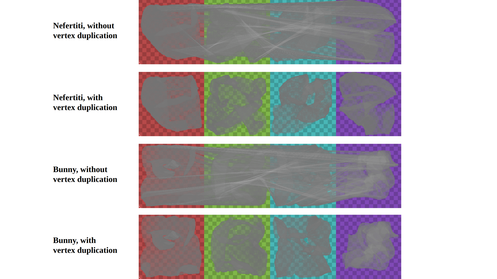

# Nuvo
Personal Implementation of the paper: Nuvo: Neural UV Mapping for Unruly 3D Representations

## Dependencies
Tested environment:
- Linux Ubuntu 20.04
- RTX 4090

To install the required libraries, run:
```bash
conda create -n nuvo python=3.9
conda activate nuvo
pip install -r requirements.txt
```

I used Pytorch 2.3.0 with CUDA 11.8. Other versions may work, but are not tested.

## Training
```
python train.py --config configs/<config-name.json>
```

## Results
Below are the predicted UV mappings for the bunny mesh.
1. Bunny

https://github.com/user-attachments/assets/df588d3e-0942-4b76-b0a4-735db074a3d7

## Features
In the default Nuvo implementation, some triangles may have vertices that span different UV charts. This can be problematic for rendering and texture mapping, as there will be interpolation across the charts (see the first and third rows of the below figure).
To address this issue, we implemented a vertex duplication feature that prevents this interpolation (see the second and fourth rows).

The vertex duplication is used by default. To disable it, set `use_vertex_duplication` to `false` in the config file.




## Acknowledgement

This repository is based on the following paper / resources:
-  [Nuvo: Neural UV Mapping for Unruly 3D Representations](https://pratulsrinivasan.github.io/nuvo/)
```
  @article{srinivasan2023nuvo,
    author    = {Pratul P. Srinivasan and Stephan J. Garbin and Dor Verbin and Jonathan T. Barron and Ben Mildenhall},
    title     = {Nuvo: Neural UV Mapping for Unruly 3D Representations},
    journal = {arXiv},
    year      = {2023},
  }
```

- [Alec Jacobson's collection of 3D models](https://github.com/alecjacobson/common-3d-test-models)
