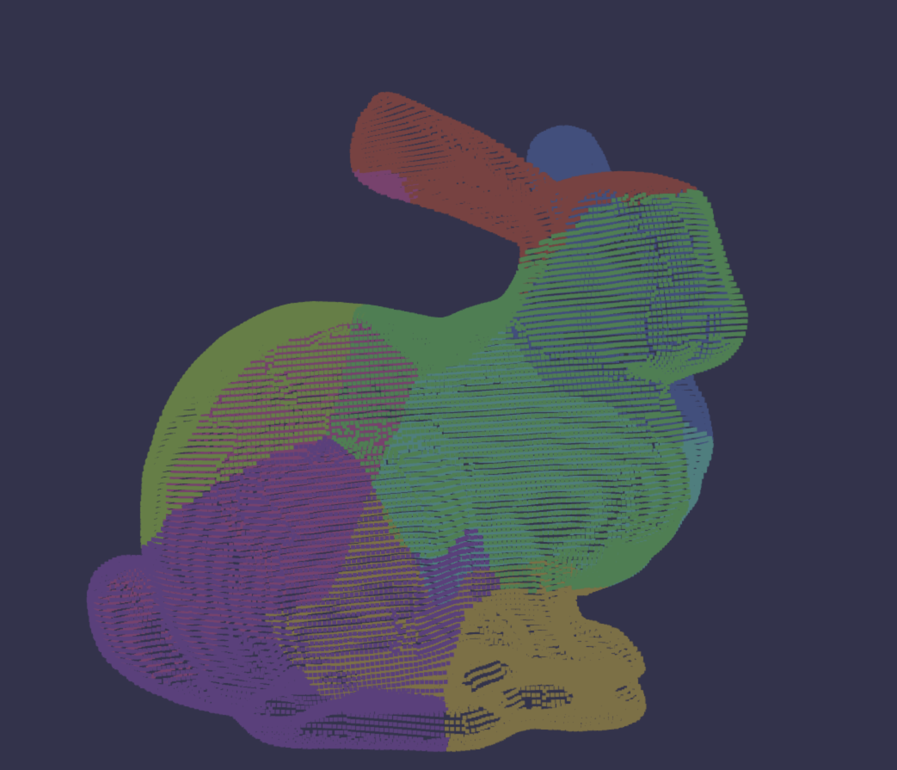
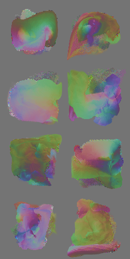
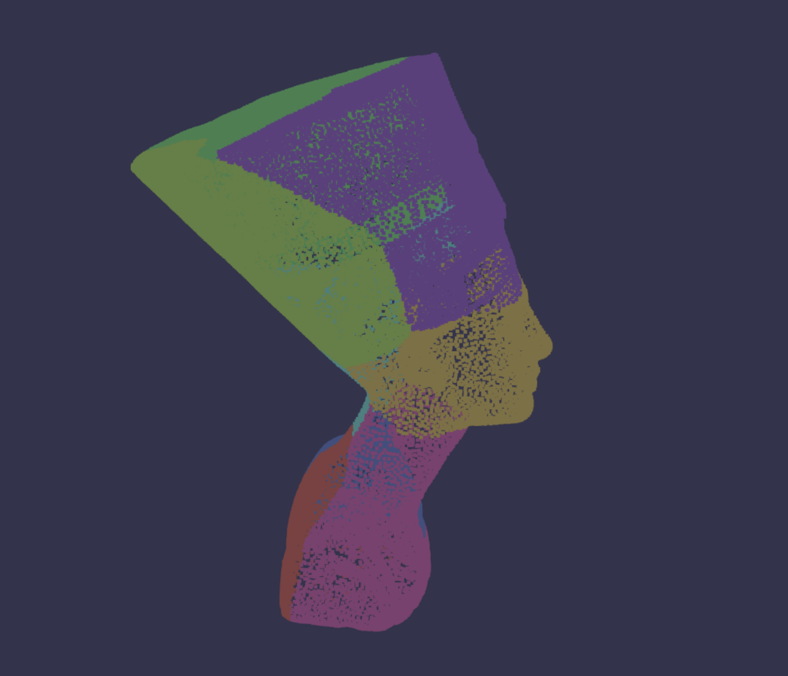
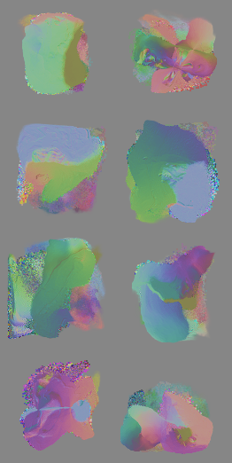

# Nuvo
Personal Implementation of the paper: Nuvo: Neural UV Mapping for Unruly 3D Representations

## Dependencies
Tested environment:
- Linux Ubuntu 20.04
- RTX 4090

To install the required libraries, run:
```bash
conda create -n nuvo python=3.9
conda activate nuvo
pip install -r requirements.txt
```

I used Pytorch 2.3.0 with CUDA 11.8. Other versions may work, but are not tested.

## Training
```
python train.py --config configs/<config-name.json>
```

## Results
Below are the point cloud visualizations of the predicted UV mappings for the bunny and nefertiti meshes. Vertices that belong to the same UV mapping are assigned the same color. The predicted normal field is also attached for reference.
1. Bunny
   



2. Nefertiti




## Acknowledgement

This repository is based on the following paper / resources:
-  [Nuvo: Neural UV Mapping for Unruly 3D Representations](https://pratulsrinivasan.github.io/nuvo/)
```
  @article{srinivasan2023nuvo,
    author    = {Pratul P. Srinivasan and Stephan J. Garbin and Dor Verbin and Jonathan T. Barron and Ben Mildenhall},
    title     = {Nuvo: Neural UV Mapping for Unruly 3D Representations},
    journal = {arXiv},
    year      = {2023},
  }
```

- [Alec Jacobson's collection of 3D models](https://github.com/alecjacobson/common-3d-test-models)
